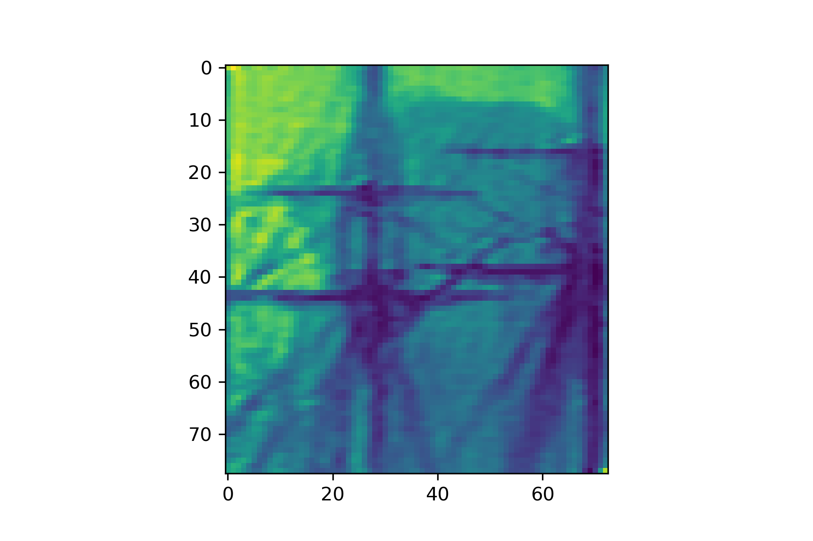
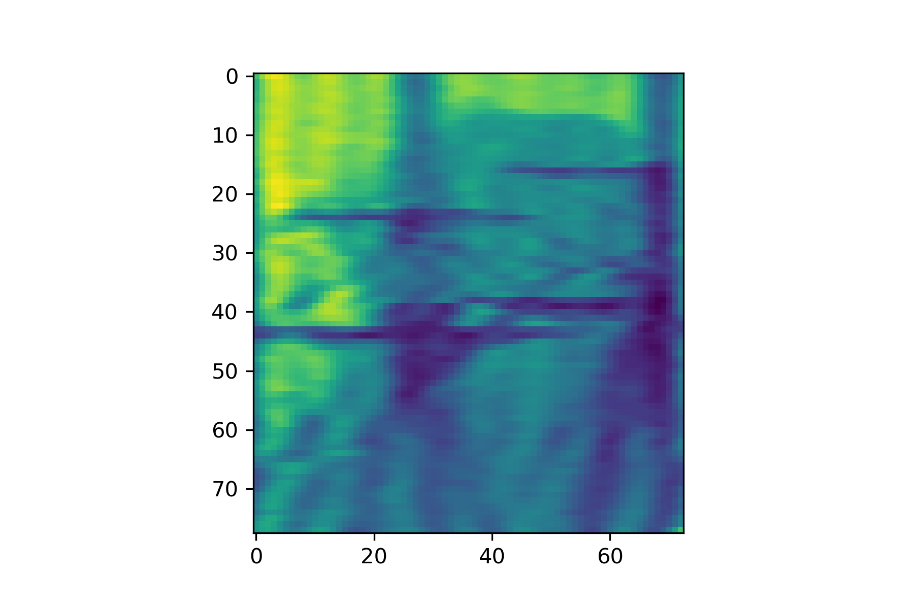

# simpleDFT

a simple Discrete Fourier Transform(DFT) implementation,aiming at understanding the math.

* Image & Function inputs are supported.

---

一个简单的离散傅里叶变换。用来理解DFT的数学原理。

* 支持输入函数和图像。

---

Original：

Reconstructed:

Amplitude-Frequency Info:

